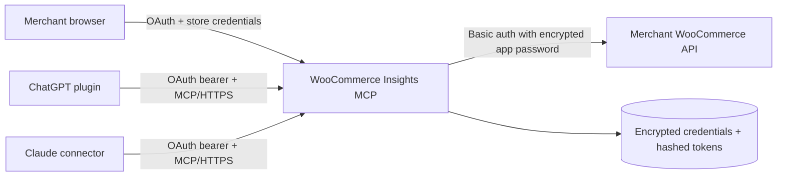

# WooCommerce Insights MCP

A working, multi-tenant, read-only MCP service that connects WooCommerce stores to ChatGPT and Claude. Merchants authorize with a WordPress username and application password in an OAuth 2.1 browser flow; assistants receive an OAuth token for this service and never see the WooCommerce credential.

## Architecture



The same `/mcp` endpoint serves both assistants. The service implements streamable HTTP, OAuth discovery, dynamic client registration, authorization code + PKCE, refresh-token rotation, revocation, encrypted credential storage, SSRF checks, and privacy-minimized tool output.

## Available tools

| Tool | Purpose |
|---|---|
| `get_store_overview` | Product and order counts |
| `search_products` | Search catalog, pricing, stock, categories, and ratings |
| `get_product` | Fetch one product by ID or SKU |
| `list_orders` | List totals and line items without direct customer identifiers |
| `get_sales_summary` | Revenue, refunds, AOV, items sold, and status mix |
| `get_top_products` | Rank product/variation performance by revenue |
| `get_inventory_alerts` | Find low-stock and out-of-stock products |

All tools are annotated read-only, non-destructive, and idempotent.

## Run locally

Requirements: Node.js 22.13 or later and a WooCommerce store with REST API access.

```powershell
npm install
Copy-Item .env.example .env
node -e "console.log(require('node:crypto').randomBytes(32).toString('base64'))"
```

Put the generated key in `.env`, then export the variables in your shell or use a dotenv-aware process manager. The service intentionally does not load `.env` on its own in production.

```powershell
$env:PUBLIC_BASE_URL = "http://localhost:3000"
$env:CREDENTIAL_ENCRYPTION_KEY = "<generated base64 key>"
$env:ALLOW_PRIVATE_WOO_HOSTS = "true"
npm run dev
```

`ALLOW_PRIVATE_WOO_HOSTS=true` is only for a local WooCommerce test site. Never enable it on an internet-facing deployment.

## Run with Docker

Set `PUBLIC_BASE_URL` and `CREDENTIAL_ENCRYPTION_KEY` in your environment, then:

```bash
docker compose up --build -d
```

Terminate TLS at a reverse proxy or managed load balancer and expose `${PUBLIC_BASE_URL}/mcp`. Keep one application replica while using the included SQLite database. See [security and scaling notes](docs/SECURITY.md).

## Connect a WooCommerce store

The WordPress user should be an Administrator or Shop Manager with permission to read WooCommerce products and orders. In WordPress, open Users → Profile → Application Passwords and create a dedicated password for this connector. During assistant OAuth, enter:

- the store's public HTTPS URL (WordPress subdirectory URLs are supported);
- the WordPress username;
- the dedicated application password.

The password is verified with `wp-json/wc/v3`, encrypted with AES-256-GCM, and stored only by this service.

## Connect ChatGPT

Deploy the server to public HTTPS first. In ChatGPT, enable Developer mode, open Plugins, add a connection, and enter the full `https://<domain>/mcp` URL. Complete OAuth and review the discovered tools. The checked-in [plugin package](plugins/woocommerce-insights/.codex-plugin/plugin.json) is validated and ready for its final domain; update [the MCP URL](plugins/woocommerce-insights/.mcp.json) after deployment.

ChatGPT generates a `plugin_asdk_app...` technical ID when the remote MCP connection is registered. That external ID is required to create the final `.app.json` used for a locally installed ChatGPT plugin, so it cannot be hard-coded before registration. Public plugin submission scans the deployed MCP server directly.

## Install the Codex plugin on another computer

The repository includes a Git marketplace, so each Codex desktop, CLI, or IDE user can install the same remote MCP server without editing a local configuration file:

```bash
codex plugin marketplace add faridhn2/MCPWCM --ref main
codex plugin add woocommerce-insights@mcpwcm
```

Restart Codex, enable **WooCommerce Insights** in Plugins, and select **Authenticate**. Each person (and each computer) completes OAuth with their own WordPress username and Application Password. OAuth tokens and encrypted WooCommerce credentials are intentionally not shared between computers or ChatGPT accounts.

Codex chooses a loopback callback port locally for every authorization. The server accepts that dynamic callback as required for native-app OAuth. If a browser blocks the automatic handoff after the store is verified, the authorization response displays a **Return to the assistant** button; select it once instead of resubmitting the credentials form.

ChatGPT on the web does not read a computer's local Codex configuration. To use the service in ChatGPT web, add the public `https://mcp.cdemy.ir/mcp` connection or install its published remote plugin in the target ChatGPT account.
## Connect Claude

In Claude, go to Customize → Connectors → Add custom connector and enter the same `https://<domain>/mcp` URL. The OAuth discovery and dynamic registration endpoints are shared with ChatGPT. On Team and Enterprise plans, an Owner must add the custom web connector at the organization level before members connect it.

## Verify

```bash
npm run check
npx @modelcontextprotocol/inspector@latest
```

The automated suite covers encryption, URL/SSRF rules, OAuth grant binding and rotation, WooCommerce request behavior, analytics, privacy filtering primitives, MCP tool discovery, annotations, and a real MCP tool call over in-memory transport.

For release work, use the [submission checklist](docs/SUBMISSION_CHECKLIST.md) and customize the [privacy policy template](docs/PRIVACY_TEMPLATE.md).

## Scope and next production step

This is a complete single-replica MVP/pilot. Before broad multi-merchant launch, replace SQLite with PostgreSQL, add edge rate limiting and centralized audit metrics, publish legal/support pages, run live-store evaluations, and submit the deployed MCP endpoint to the ChatGPT plugin directory. Write tools should be a separate release with narrower scopes and explicit confirmation semantics.
